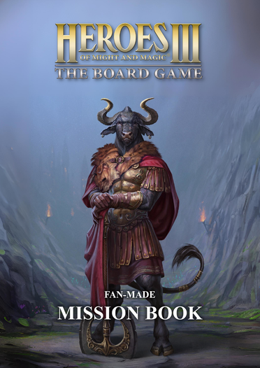
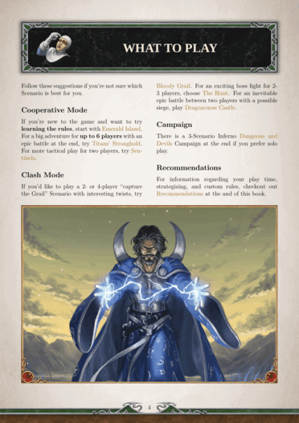
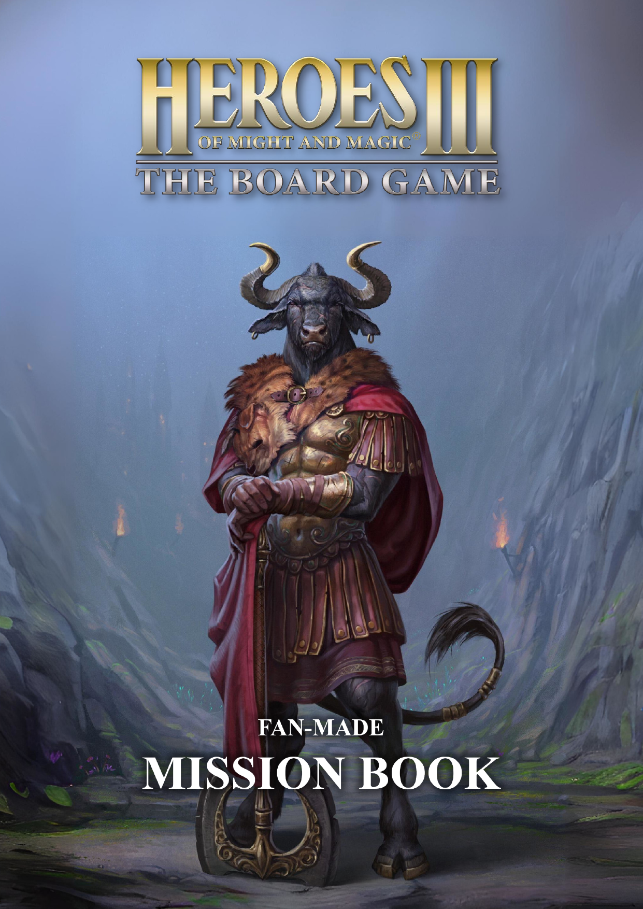
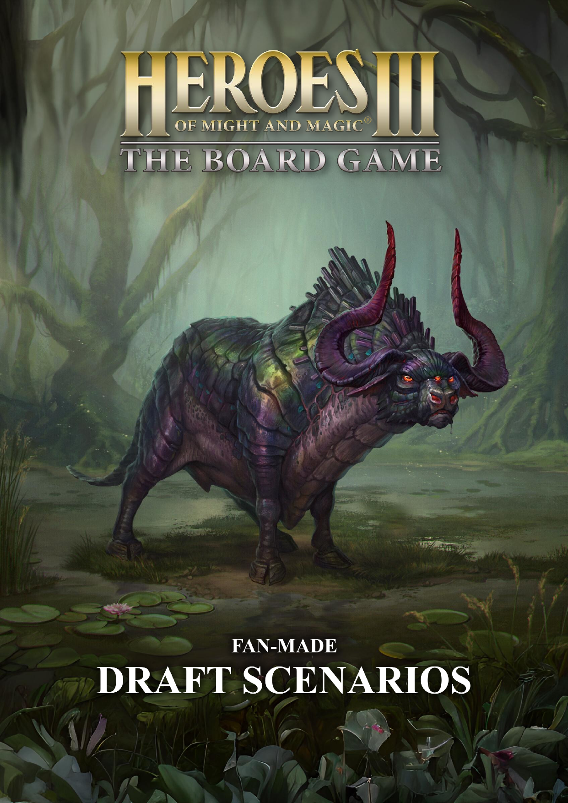

  <h1>Heroes of Might & Magic III: The Board Game Fan-Made Mission Book</h1>

  

    
    
  

  

Click on the table to download the most recent builds of the Mission Book in the chosen language.
If your intention is to **print in black and white**, download the **monochrome** version.

<table>
    <thead>
        <tr>
            <th>Language</th>
            <th align="center">Version 1.2 🪨 (Stable)</th>
            <th align="center">Latest Build ⚗️ (Experimental)</th>
            <th align="center">Latest Build 🖨️  (Monochrome)</th>
            <th align="center">Draft Scenarios 🏗️</th>
            <th align="center">Draft Scenarios 🖨️  (Monochrome)</th>
        </tr>
    </thead>
    <tbody>
        <tr>
            <td>🇬🇧 English</td>
            <td align="center"><a href="https://github.com/qwrtln/Homm3BG-mission-book/releases/download/v1.2/Heroes3_English_Fan_Made_Mission_Book_1_2.pdf">download</a></td>
            <td align="center">️<a href="https://raw.githubusercontent.com/qwrtln/Homm3BG-mission-book-build-artifacts/en/main_en.pdf">download</a></td>
            <td align="center">️<a href="https://raw.githubusercontent.com/qwrtln/Homm3BG-mission-book-build-artifacts/en/main_en-mono.pdf">download</a></td>
            <td align="center">️<a href="https://raw.githubusercontent.com/qwrtln/Homm3BG-mission-book-build-artifacts/drafts/drafts.pdf">download</a></td>
            <td align="center">️<a href="https://raw.githubusercontent.com/qwrtln/Homm3BG-mission-book-build-artifacts/drafts/drafts-mono.pdf">download</a></td>
        </tr>
        <tr>
            <td>
            🇵🇱 Polski 
            
            </td>
            <td align="center"><a href="https://github.com/qwrtln/Homm3BG-mission-book/releases/download/v1.2/Heroes3_Polski_Fan_Made_Mission_Book_1_2.pdf">pobierz</a></td>
            <td align="center"><a href="https://raw.githubusercontent.com/qwrtln/Homm3BG-mission-book-build-artifacts/pl/main_pl.pdf">️pobierz</a></td>
            <td align="center"><a href="https://raw.githubusercontent.com/qwrtln/Homm3BG-mission-book-build-artifacts/pl/main_pl-mono.pdf">️pobierz</a></td>
            <td align="center">—</td>
            <td align="center">—</td>
        </tr>
        <tr>
            <td>🇨🇿 Čeština 
            </td>
            <td align="center">—</td>
            <td align="center"><a href="https://raw.githubusercontent.com/qwrtln/Homm3BG-mission-book-build-artifacts/cs/main_cs.pdf">stáhnout</a></td>
            <td align="center"><a href="https://raw.githubusercontent.com/qwrtln/Homm3BG-mission-book-build-artifacts/cs/main_cs-mono.pdf">stáhnout</a></td>
            <td align="center">—</td>
            <td align="center">—</td>
        </tr>
        <tr>
            <td>🇫🇷 Français 
            </td>
            <td align="center">—</td>
            <td align="center"><a href="https://raw.githubusercontent.com/qwrtln/Homm3BG-mission-book-build-artifacts/fr/main_fr.pdf">télécharger</a></td>
            <td align="center"><a href="https://raw.githubusercontent.com/qwrtln/Homm3BG-mission-book-build-artifacts/fr/main_fr-mono.pdf">télécharger</a></td>
            <td align="center">—</td>
            <td align="center">—</td>
        </tr>
        <tr>
            <td>🇩🇪 Deutsch 
            </td>
            <td align="center">—</td>
            <td align="center"><a href="https://raw.githubusercontent.com/qwrtln/Homm3BG-mission-book-build-artifacts/de/main_de.pdf">speichern</a></td>
            <td align="center"><a href="https://raw.githubusercontent.com/qwrtln/Homm3BG-mission-book-build-artifacts/de/main_de-mono.pdf">speichern</a></td>
            <td align="center">—</td>
            <td align="center">—</td>
        </tr>
    </tbody>
</table>

Click for a table with <strong>individual scenarios</strong> 👇

### Legend:

#### Scenario types:
 - 🤝 Coop
 - ⚔️ Clash
 - 🗺️ Campaign

#### Fle types:
 - 🎨 Full color
 - 🖨️ For monochrome printing

Number of players (P) in the brackets.

<table>
    <thead>
        <tr>
            <th>Scenario</th>
            <th colspan=2 align="center">🇬🇧 English</th>
            <th colspan=2 align="center">🇵🇱 Polski</th>
            <th colspan=2 align="center">🇨🇿 Čeština</th>
            <th colspan=2 align="center">🇫🇷 Français</th>
        </tr>
    </thead>
    <tbody>
        <tr>
            <td align="center">-</td>
            <td align="center">🎨 color</td>
            <td align="center">🖨️ mono</td>
            <td align="center">🎨 color</td>
            <td align="center">🖨️ mono</td>
            <td align="center">🎨 color</td>
            <td align="center">🖨️ mono</td>
            <td align="center">🎨 color</td>
            <td align="center">🖨️ mono</td>
        </tr>
        <tr>
            <td>🤝 Sentinels (2)</td>
            <td align="center"><a href="https://raw.githubusercontent.com/qwrtln/Homm3BG-mission-book-build-artifacts/en-sentinels/sentinels_en.pdf">click</a></td>
            <td align="center"><a href="https://raw.githubusercontent.com/qwrtln/Homm3BG-mission-book-build-artifacts/en-sentinels/sentinels_en_mono.pdf">click</a></td>
            <td align="center"><a href="https://raw.githubusercontent.com/qwrtln/Homm3BG-mission-book-build-artifacts/pl-sentinels/sentinels_pl.pdf">click</a></td>
            <td align="center"><a href="https://raw.githubusercontent.com/qwrtln/Homm3BG-mission-book-build-artifacts/pl-sentinels/sentinels_pl_mono.pdf">click</a></td>
            <td align="center"><a href="https://raw.githubusercontent.com/qwrtln/Homm3BG-mission-book-build-artifacts/cs-sentinels/sentinels_cs.pdf">click</a></td>
            <td align="center"><a href="https://raw.githubusercontent.com/qwrtln/Homm3BG-mission-book-build-artifacts/cs-sentinels/sentinels_cs_mono.pdf">click</a></td>
            <td align="center"><a href="https://raw.githubusercontent.com/qwrtln/Homm3BG-mission-book-build-artifacts/fr-sentinels/sentinels_fr.pdf">click</a></td>
            <td align="center"><a href="https://raw.githubusercontent.com/qwrtln/Homm3BG-mission-book-build-artifacts/fr-sentinels/sentinels_fr_mono.pdf">click</a></td>
        </tr>
        <tr>
            <td>🤝 Titans' Stronghold (1-6)</td>
            <td align="center"><a href="https://raw.githubusercontent.com/qwrtln/Homm3BG-mission-book-build-artifacts/en-titans_stronghold/titans_stronghold_en.pdf">click</a></td>
            <td align="center"><a href="https://raw.githubusercontent.com/qwrtln/Homm3BG-mission-book-build-artifacts/en-titans_stronghold/titans_stronghold_en_mono.pdf">click</a></td>
            <td align="center"><a href="https://raw.githubusercontent.com/qwrtln/Homm3BG-mission-book-build-artifacts/pl-titans_stronghold/titans_stronghold_pl.pdf">click</a></td>
            <td align="center"><a href="https://raw.githubusercontent.com/qwrtln/Homm3BG-mission-book-build-artifacts/pl-titans_stronghold/titans_stronghold_pl_mono.pdf">click</a></td>
            <td align="center"><a href="https://raw.githubusercontent.com/qwrtln/Homm3BG-mission-book-build-artifacts/cs-titans_stronghold/titans_stronghold_cs.pdf">click</a></td>
            <td align="center"><a href="https://raw.githubusercontent.com/qwrtln/Homm3BG-mission-book-build-artifacts/cs-titans_stronghold/titans_stronghold_cs_mono.pdf">click</a></td>
            <td align="center"><a href="https://raw.githubusercontent.com/qwrtln/Homm3BG-mission-book-build-artifacts/fr-titans_stronghold/titans_stronghold_fr.pdf">click</a></td>
            <td align="center"><a href="https://raw.githubusercontent.com/qwrtln/Homm3BG-mission-book-build-artifacts/fr-titans_stronghold/titans_stronghold_fr_mono.pdf">click</a></td>
        </tr>
        <tr>
            <td>🤝 Emerald Island (1-4)</td>
            <td align="center"><a href="https://raw.githubusercontent.com/qwrtln/Homm3BG-mission-book-build-artifacts/en-emerald_island/emerald_island_en.pdf">click</a></td>
            <td align="center"><a href="https://raw.githubusercontent.com/qwrtln/Homm3BG-mission-book-build-artifacts/en-emerald_island/emerald_island_en_mono.pdf">click</a></td>
            <td align="center"><a href="https://raw.githubusercontent.com/qwrtln/Homm3BG-mission-book-build-artifacts/pl-emerald_island/emerald_island_pl.pdf">click</a></td>
            <td align="center"><a href="https://raw.githubusercontent.com/qwrtln/Homm3BG-mission-book-build-artifacts/pl-emerald_island/emerald_island_pl_mono.pdf">click</a></td>
            <td align="center"><a href="https://raw.githubusercontent.com/qwrtln/Homm3BG-mission-book-build-artifacts/cs-emerald_island/emerald_island_cs.pdf">click</a></td>
            <td align="center"><a href="https://raw.githubusercontent.com/qwrtln/Homm3BG-mission-book-build-artifacts/cs-emerald_island/emerald_island_cs_mono.pdf">click</a></td>
            <td align="center">-</td>
            <td align="center">-</td>
        </tr>
        <tr>
            <td>🤝 Close to Enemies (1-6)</td>
            <td align="center"><a href="https://raw.githubusercontent.com/qwrtln/Homm3BG-mission-book-build-artifacts/en-close_to_enemies/close_to_enemies_en.pdf">click</a></td>
            <td align="center"><a href="https://raw.githubusercontent.com/qwrtln/Homm3BG-mission-book-build-artifacts/en-close_to_enemies/close_to_enemies_en_mono.pdf">click</a></td>
            <td align="center"><a href="https://raw.githubusercontent.com/qwrtln/Homm3BG-mission-book-build-artifacts/pl-close_to_enemies/close_to_enemies_pl.pdf">click</a></td>
            <td align="center"><a href="https://raw.githubusercontent.com/qwrtln/Homm3BG-mission-book-build-artifacts/pl-close_to_enemies/close_to_enemies_pl_mono.pdf">click</a></td>
            <td align="center"><a href="https://raw.githubusercontent.com/qwrtln/Homm3BG-mission-book-build-artifacts/cs-close_to_enemies/close_to_enemies_cs.pdf">click</a></td>
            <td align="center"><a href="https://raw.githubusercontent.com/qwrtln/Homm3BG-mission-book-build-artifacts/cs-close_to_enemies/close_to_enemies_cs_mono.pdf">click</a></td>
            <td align="center"><a href="https://raw.githubusercontent.com/qwrtln/Homm3BG-mission-book-build-artifacts/fr-close_to_enemies/close_to_enemies_fr.pdf">click</a></td>
            <td align="center"><a href="https://raw.githubusercontent.com/qwrtln/Homm3BG-mission-book-build-artifacts/fr-close_to_enemies/close_to_enemies_fr_mono.pdf">click</a></td>
        </tr>
        <tr>
            <td>🤝 Stand United (2-4)</td>
            <td align="center"><a href="https://raw.githubusercontent.com/qwrtln/Homm3BG-mission-book-build-artifacts/en-stand_united/stand_united_en.pdf">click</a></td>
            <td align="center"><a href="https://raw.githubusercontent.com/qwrtln/Homm3BG-mission-book-build-artifacts/en-stand_united/stand_united_en_mono.pdf">click</a></td>
            <td align="center"><a href="https://raw.githubusercontent.com/qwrtln/Homm3BG-mission-book-build-artifacts/pl-stand_united/stand_united_pl.pdf">click</a></td>
            <td align="center"><a href="https://raw.githubusercontent.com/qwrtln/Homm3BG-mission-book-build-artifacts/pl-stand_united/stand_united_pl_mono.pdf">click</a></td>
            <td align="center"><a href="https://raw.githubusercontent.com/qwrtln/Homm3BG-mission-book-build-artifacts/cs-stand_united/stand_united_cs.pdf">click</a></td>
            <td align="center"><a href="https://raw.githubusercontent.com/qwrtln/Homm3BG-mission-book-build-artifacts/cs-stand_united/stand_united_cs_mono.pdf">click</a></td>
            <td align="center">-</td>
            <td align="center">-</td>
        </tr>
        <tr>
            <td>⚔️ Bloody Grail (2 or 4)</td>
            <td align="center"><a href="https://raw.githubusercontent.com/qwrtln/Homm3BG-mission-book-build-artifacts/en-bloody_grail/bloody_grail_en.pdf">click</a></td>
            <td align="center"><a href="https://raw.githubusercontent.com/qwrtln/Homm3BG-mission-book-build-artifacts/en-bloody_grail/bloody_grail_en_mono.pdf">click</a></td>
            <td align="center"><a href="https://raw.githubusercontent.com/qwrtln/Homm3BG-mission-book-build-artifacts/pl-bloody_grail/bloody_grail_pl.pdf">click</a></td>
            <td align="center"><a href="https://raw.githubusercontent.com/qwrtln/Homm3BG-mission-book-build-artifacts/pl-bloody_grail/bloody_grail_pl_mono.pdf">click</a></td>
            <td align="center"><a href="https://raw.githubusercontent.com/qwrtln/Homm3BG-mission-book-build-artifacts/cs-bloody_grail/bloody_grail_cs.pdf">click</a></td>
            <td align="center"><a href="https://raw.githubusercontent.com/qwrtln/Homm3BG-mission-book-build-artifacts/cs-bloody_grail/bloody_grail_cs_mono.pdf">click</a></td>
            <td align="center">-</td>
            <td align="center">-</td>
        </tr>
        <tr>
            <td>⚔️ The Hunt (2-3)</td>
            <td align="center"><a href="https://raw.githubusercontent.com/qwrtln/Homm3BG-mission-book-build-artifacts/en-the_hunt/the_hunt_en.pdf">click</a></td>
            <td align="center"><a href="https://raw.githubusercontent.com/qwrtln/Homm3BG-mission-book-build-artifacts/en-the_hunt/the_hunt_en_mono.pdf">click</a></td>
            <td align="center"><a href="https://raw.githubusercontent.com/qwrtln/Homm3BG-mission-book-build-artifacts/pl-the_hunt/the_hunt_pl.pdf">click</a></td>
            <td align="center"><a href="https://raw.githubusercontent.com/qwrtln/Homm3BG-mission-book-build-artifacts/pl-the_hunt/the_hunt_pl_mono.pdf">click</a></td>
            <td align="center"><a href="https://raw.githubusercontent.com/qwrtln/Homm3BG-mission-book-build-artifacts/cs-the_hunt/the_hunt_cs.pdf">click</a></td>
            <td align="center"><a href="https://raw.githubusercontent.com/qwrtln/Homm3BG-mission-book-build-artifacts/cs-the_hunt/the_hunt_cs_mono.pdf">click</a></td>
            <td align="center">-</td>
            <td align="center">-</td>
        </tr>
        <tr>
            <td>⚔️ Dragoncurse Castle (2)</td>
            <td align="center"><a href="https://raw.githubusercontent.com/qwrtln/Homm3BG-mission-book-build-artifacts/en-dragoncurse_castle/dragoncurse_castle_en.pdf">click</a></td>
            <td align="center"><a href="https://raw.githubusercontent.com/qwrtln/Homm3BG-mission-book-build-artifacts/en-dragoncurse_castle/dragoncurse_castle_en_mono.pdf">click</a></td>
            <td align="center"><a href="https://raw.githubusercontent.com/qwrtln/Homm3BG-mission-book-build-artifacts/pl-dragoncurse_castle/dragoncurse_castle_pl.pdf">click</a></td>
            <td align="center"><a href="https://raw.githubusercontent.com/qwrtln/Homm3BG-mission-book-build-artifacts/pl-dragoncurse_castle/dragoncurse_castle_pl_mono.pdf">click</a></td>
            <td align="center"><a href="https://raw.githubusercontent.com/qwrtln/Homm3BG-mission-book-build-artifacts/cs-dragoncurse_castle/dragoncurse_castle_cs.pdf">click</a></td>
            <td align="center"><a href="https://raw.githubusercontent.com/qwrtln/Homm3BG-mission-book-build-artifacts/cs-dragoncurse_castle/dragoncurse_castle_cs_mono.pdf">click</a></td>
            <td align="center">-</td>
            <td align="center">-</td>
        </tr>
        <tr>
            <td>⚔️ Force of Will (2-3)</td>
            <td align="center"><a href="https://raw.githubusercontent.com/qwrtln/Homm3BG-mission-book-build-artifacts/en-force_of_will/force_of_will_en.pdf">click</a></td>
            <td align="center"><a href="https://raw.githubusercontent.com/qwrtln/Homm3BG-mission-book-build-artifacts/en-force_of_will/force_of_will_en_mono.pdf">click</a></td>
            <td align="center"><a href="https://raw.githubusercontent.com/qwrtln/Homm3BG-mission-book-build-artifacts/pl-force_of_will/force_of_will_pl.pdf">click</a></td>
            <td align="center"><a href="https://raw.githubusercontent.com/qwrtln/Homm3BG-mission-book-build-artifacts/pl-force_of_will/force_of_will_pl_mono.pdf">click</a></td>
            <td align="center"><a href="https://raw.githubusercontent.com/qwrtln/Homm3BG-mission-book-build-artifacts/cs-force_of_will/force_of_will_cs.pdf">click</a></td>
            <td align="center"><a href="https://raw.githubusercontent.com/qwrtln/Homm3BG-mission-book-build-artifacts/cs-force_of_will/force_of_will_cs_mono.pdf">click</a></td>
            <td align="center">-</td>
            <td align="center">-</td>
        </tr>
        <tr>
            <td>⚔️ The Fractured Kingdoms (5)</td>
            <td align="center"><a href="https://raw.githubusercontent.com/qwrtln/Homm3BG-mission-book-build-artifacts/en-the_fractured_kingdoms/the_fractured_kingdoms_en.pdf">click</a></td>
            <td align="center"><a href="https://raw.githubusercontent.com/qwrtln/Homm3BG-mission-book-build-artifacts/en-the_fractured_kingdoms/the_fractured_kingdoms_en_mono.pdf">click</a></td>
            <td align="center"><a href="https://raw.githubusercontent.com/qwrtln/Homm3BG-mission-book-build-artifacts/pl-the_fractured_kingdoms/the_fractured_kingdoms_pl.pdf">click</a></td>
            <td align="center"><a href="https://raw.githubusercontent.com/qwrtln/Homm3BG-mission-book-build-artifacts/pl-the_fractured_kingdoms/the_fractured_kingdoms_pl_mono.pdf">click</a></td>
            <td align="center"><a href="https://raw.githubusercontent.com/qwrtln/Homm3BG-mission-book-build-artifacts/cs-the_fractured_kingdoms/the_fractured_kingdoms_cs.pdf">click</a></td>
            <td align="center"><a href="https://raw.githubusercontent.com/qwrtln/Homm3BG-mission-book-build-artifacts/cs-the_fractured_kingdoms/the_fractured_kingdoms_cs_mono.pdf">click</a></td>
            <td align="center">-</td>
            <td align="center">-</td>
        </tr>
        <tr>
            <td>⚔️ Trial by Combat (2-4)</td>
            <td align="center"><a href="https://raw.githubusercontent.com/qwrtln/Homm3BG-mission-book-build-artifacts/en-trial_by_combat/trial_by_combat_en.pdf">click</a></td>
            <td align="center"><a href="https://raw.githubusercontent.com/qwrtln/Homm3BG-mission-book-build-artifacts/en-trial_by_combat/trial_by_combat_en_mono.pdf">click</a></td>
            <td align="center">-</td>
            <td align="center">-</td>
            <td align="center">-</td>
            <td align="center">-</td>
            <td align="center">-</td>
            <td align="center">-</td>
        </tr>
        <tr>
            <td>🗺️ Inferno: A Devilish Plan (1)</td>
            <td align="center"><a href="https://raw.githubusercontent.com/qwrtln/Homm3BG-mission-book-build-artifacts/en-inferno_devilish_plan/inferno_devilish_plan_en.pdf">click</a></td>
            <td align="center"><a href="https://raw.githubusercontent.com/qwrtln/Homm3BG-mission-book-build-artifacts/en-inferno_devilish_plan/inferno_devilish_plan_en_mono.pdf">click</a></td>
            <td align="center"><a href="https://raw.githubusercontent.com/qwrtln/Homm3BG-mission-book-build-artifacts/pl-inferno_devilish_plan/inferno_devilish_plan_pl.pdf">click</a></td>
            <td align="center"><a href="https://raw.githubusercontent.com/qwrtln/Homm3BG-mission-book-build-artifacts/pl-inferno_devilish_plan/inferno_devilish_plan_pl_mono.pdf">click</a></td>
            <td align="center"><a href="https://raw.githubusercontent.com/qwrtln/Homm3BG-mission-book-build-artifacts/cs-inferno_devilish_plan/inferno_devilish_plan_cs.pdf">click</a></td>
            <td align="center"><a href="https://raw.githubusercontent.com/qwrtln/Homm3BG-mission-book-build-artifacts/cs-inferno_devilish_plan/inferno_devilish_plan_cs_mono.pdf">click</a></td>
            <td align="center">-</td>
            <td align="center">-</td>
        </tr>
        <tr>
            <td>🗺️ Inferno: Steadwick's Fall (1)</td>
            <td align="center"><a href="https://raw.githubusercontent.com/qwrtln/Homm3BG-mission-book-build-artifacts/en-inferno_steadwicks_fall/inferno_steadwicks_fall_en.pdf">click</a></td>
            <td align="center"><a href="https://raw.githubusercontent.com/qwrtln/Homm3BG-mission-book-build-artifacts/en-inferno_steadwicks_fall/inferno_steadwicks_fall_en_mono.pdf">click</a></td>
            <td align="center"><a href="https://raw.githubusercontent.com/qwrtln/Homm3BG-mission-book-build-artifacts/pl-inferno_steadwicks_fall/inferno_steadwicks_fall_pl.pdf">click</a></td>
            <td align="center"><a href="https://raw.githubusercontent.com/qwrtln/Homm3BG-mission-book-build-artifacts/pl-inferno_steadwicks_fall/inferno_steadwicks_fall_pl_mono.pdf">click</a></td>
            <td align="center"><a href="https://raw.githubusercontent.com/qwrtln/Homm3BG-mission-book-build-artifacts/cs-inferno_steadwicks_fall/inferno_steadwicks_fall_cs.pdf">click</a></td>
            <td align="center"><a href="https://raw.githubusercontent.com/qwrtln/Homm3BG-mission-book-build-artifacts/cs-inferno_steadwicks_fall/inferno_steadwicks_fall_cs_mono.pdf">click</a></td>
            <td align="center">-</td>
            <td align="center">-</td>
        </tr>
        <tr>
            <td>🗺️ Inferno: Deal with the Devil (1)</td>
            <td align="center"><a href="https://raw.githubusercontent.com/qwrtln/Homm3BG-mission-book-build-artifacts/en-inferno_deal_with_the_devil/inferno_deal_with_the_devil_en.pdf">click</a></td>
            <td align="center"><a href="https://raw.githubusercontent.com/qwrtln/Homm3BG-mission-book-build-artifacts/en-inferno_deal_with_the_devil/inferno_deal_with_the_devil_en_mono.pdf">click</a></td>
            <td align="center"><a href="https://raw.githubusercontent.com/qwrtln/Homm3BG-mission-book-build-artifacts/pl-inferno_deal_with_the_devil/inferno_deal_with_the_devil_pl.pdf">click</a></td>
            <td align="center"><a href="https://raw.githubusercontent.com/qwrtln/Homm3BG-mission-book-build-artifacts/pl-inferno_deal_with_the_devil/inferno_deal_with_the_devil_pl_mono.pdf">click</a></td>
            <td align="center"><a href="https://raw.githubusercontent.com/qwrtln/Homm3BG-mission-book-build-artifacts/cs-inferno_deal_with_the_devil/inferno_deal_with_the_devil_cs.pdf">click</a></td>
            <td align="center"><a href="https://raw.githubusercontent.com/qwrtln/Homm3BG-mission-book-build-artifacts/cs-inferno_deal_with_the_devil/inferno_deal_with_the_devil_cs_mono.pdf">click</a></td>
            <td align="center">-</td>
            <td align="center">-</td>
        </tr>
        <tr>
            <td>🗺️ Castle: Greek Gift (1)</td>
            <td align="center"><a href="https://raw.githubusercontent.com/qwrtln/Homm3BG-mission-book-build-artifacts/en-castle_greek_gift/castle_greek_gift_en.pdf">click</a></td>
            <td align="center"><a href="https://raw.githubusercontent.com/qwrtln/Homm3BG-mission-book-build-artifacts/en-castle_greek_gift/castle_greek_gift_en_mono.pdf">click</a></td>
            <td align="center"><a href="https://raw.githubusercontent.com/qwrtln/Homm3BG-mission-book-build-artifacts/pl-castle_greek_gift/castle_greek_gift_pl.pdf">click</a></td>
            <td align="center"><a href="https://raw.githubusercontent.com/qwrtln/Homm3BG-mission-book-build-artifacts/pl-castle_greek_gift/castle_greek_gift_pl_mono.pdf">click</a></td>
            <td align="center"><a href="https://raw.githubusercontent.com/qwrtln/Homm3BG-mission-book-build-artifacts/cs-castle_greek_gift/castle_greek_gift_cs.pdf">click</a></td>
            <td align="center"><a href="https://raw.githubusercontent.com/qwrtln/Homm3BG-mission-book-build-artifacts/cs-castle_greek_gift/castle_greek_gift_cs_mono.pdf">click</a></td>
            <td align="center">-</td>
            <td align="center">-</td>
        </tr>
        <tr>
            <td>🗺️ Castle: Sicilian Dragon (1)</td>
            <td align="center"><a href="https://raw.githubusercontent.com/qwrtln/Homm3BG-mission-book-build-artifacts/en-castle_sicilian_dragon/castle_sicilian_dragon_en.pdf">click</a></td>
            <td align="center"><a href="https://raw.githubusercontent.com/qwrtln/Homm3BG-mission-book-build-artifacts/en-castle_sicilian_dragon/castle_sicilian_dragon_en_mono.pdf">click</a></td>
            <td align="center"><a href="https://raw.githubusercontent.com/qwrtln/Homm3BG-mission-book-build-artifacts/pl-castle_sicilian_dragon/castle_sicilian_dragon_pl.pdf">click</a></td>
            <td align="center"><a href="https://raw.githubusercontent.com/qwrtln/Homm3BG-mission-book-build-artifacts/pl-castle_sicilian_dragon/castle_sicilian_dragon_pl_mono.pdf">click</a></td>
            <td align="center"><a href="https://raw.githubusercontent.com/qwrtln/Homm3BG-mission-book-build-artifacts/cs-castle_sicilian_dragon/castle_sicilian_dragon_cs.pdf">click</a></td>
            <td align="center"><a href="https://raw.githubusercontent.com/qwrtln/Homm3BG-mission-book-build-artifacts/cs-castle_sicilian_dragon/castle_sicilian_dragon_cs_mono.pdf">click</a></td>
            <td align="center">-</td>
            <td align="center">-</td>
        </tr>
        <tr>
            <td>🗺️ Castle: Two Knights' Defense (1)</td>
            <td align="center"><a href="https://raw.githubusercontent.com/qwrtln/Homm3BG-mission-book-build-artifacts/en-castle_two_knights_defense/castle_two_knights_defense_en.pdf">click</a></td>
            <td align="center"><a href="https://raw.githubusercontent.com/qwrtln/Homm3BG-mission-book-build-artifacts/en-castle_two_knights_defense/castle_two_knights_defense_en_mono.pdf">click</a></td>
            <td align="center"><a href="https://raw.githubusercontent.com/qwrtln/Homm3BG-mission-book-build-artifacts/pl-castle_two_knights_defense/castle_two_knights_defense_pl.pdf">click</a></td>
            <td align="center"><a href="https://raw.githubusercontent.com/qwrtln/Homm3BG-mission-book-build-artifacts/pl-castle_two_knights_defense/castle_two_knights_defense_pl_mono.pdf">click</a></td>
            <td align="center"><a href="https://raw.githubusercontent.com/qwrtln/Homm3BG-mission-book-build-artifacts/cs-castle_two_knights_defense/castle_two_knights_defense_cs.pdf">click</a></td>
            <td align="center"><a href="https://raw.githubusercontent.com/qwrtln/Homm3BG-mission-book-build-artifacts/cs-castle_two_knights_defense/castle_two_knights_defense_cs_mono.pdf">click</a></td>
            <td align="center">-</td>
            <td align="center">-</td>
        </tr>
    </tbody>
</table>

You can help tarnslate this project using [Weblate](https://weblate.org/en/).
Click the image to get started:

<a href="https://hosted.weblate.org/engage/homm3bg-fan-made-mission-book/">
<picture>
  <source media="(prefers-color-scheme: dark)" srcset="https://hosted.weblate.org/widget/homm3bg-fan-made-mission-book/287x66-black.png" />
  <source media="(prefers-color-scheme: light)" srcset="https://hosted.weblate.org/widget/homm3bg-fan-made-mission-book/287x66-grey.png" />
  
</picture>
</a>

Your language is missing? Let us know on [our Discord server](https://discord.gg/nMbawQkj9R).

### 💡 What Is This?

This project aims to collect high-quality, fan-made custom scenarios and compile them into a booklet styled like [The Rewritten Rule Book](https://github.com/Heegu-sama/Homm3BG).
There are two documents:

|Mission Book ✅|Draft Scenarios 🏗️|
|:-------------:|:----------------:|
|  |  |
| A set of **community-vetted** and **well-playtested** scenarios. | An **incubation phase** before scenarios graduate to the Mission Book. |

### 🤔 Why?

Many scenarios are scattered across different platforms.
They also have inconsistent formatting.
This can be easily fixed by compiling everything into a single booklet.

### 🛠️ How?

This is a communal effort.
This repository serves as a means to version the scenarios and for the community to contribute changes.

### 💪 Contributing

We have compiled some documents to help you get started.
If you're new to Git and LaTeX, see the [local setup](https://qwrtln.github.io/Homm3BG-mission-book/) document.
There's also zero-hassle [container-based](https://qwrtln.github.io/Homm3BG-mission-book/container/) setup available.
Read our [guidelines](https://qwrtln.github.io/Homm3BG-mission-book/scenarios/) on the technicalities of starting with adding your scenario before opening a PR.
To learn how to use the scripts that facilitate the process, see the [scripts](https://qwrtln.github.io/Homm3BG-mission-book/scripts/) document.

#### 🗺️ Scenarios

Reach out to us on [our Discord server](https://discord.gg/nMbawQkj9R), if you'd like to add your scenario.
If you know your way around LaTeX and git, you can open a pull request for the Draft Scenarios.

#### 💻 Code

Do you have an idea on how to improve the LaTeX code, document layout and design, or GitHub workflows?
Great! Please reach out. We'd love to hear from you.

### Star History

<a href="https://star-history.com/#qwrtln/Homm3BG-mission-book&Date">
  <picture>
    <source media="(prefers-color-scheme: dark)" srcset="https://api.star-history.com/svg?repos=qwrtln/Homm3BG-mission-book&type=Date&theme=dark" />
    <source media="(prefers-color-scheme: light)" srcset="https://api.star-history.com/svg?repos=qwrtln/Homm3BG-mission-book&type=Date" />
    
  </picture>
</a>

### 🛡️ Other Community Projects

- [Rulebook Rewrite Project](https://github.com/Heegu-sama/Homm3BG)
- [Board Game Cards Databse](https://github.com/Mirzipan/Homm3_BG_Database)
- [Factory Rule Book](https://github.com/piotrbruzda/Homm3BG-FactoryRulebook)
- [Scenario Map Editor](https://github.com/zedero/HoMM3Boardgame)
