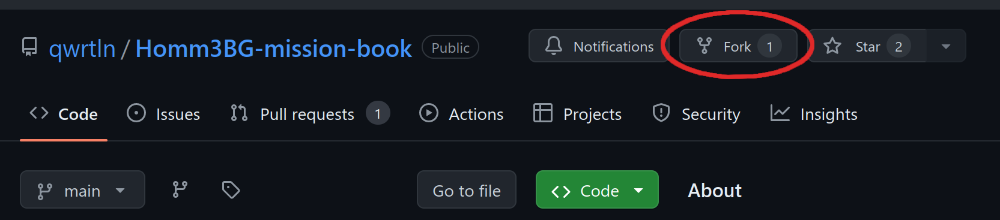
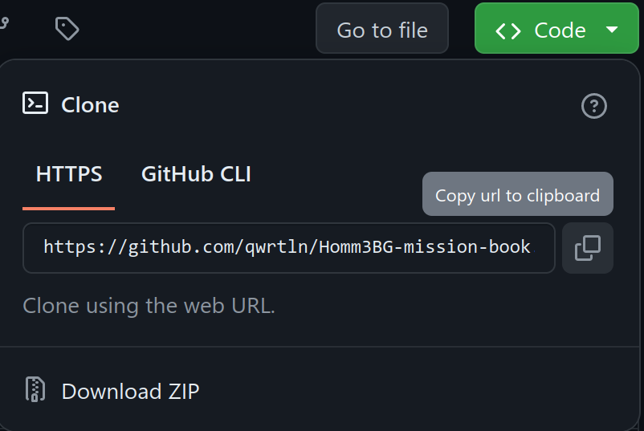

# Local Setup

In order to contribute, you'll need a [LaTeX](https://en.wikipedia.org/wiki/LaTeX) distribution, Inkscape ang git.
Please read the instructions for your operating system.

## Install required software


### Windows

Download and install the following:

 - [**MiKTeX**](https://miktex.org/) - a LaTeX distribution for Windows

 - [**Inkscape**](https://inkscape.org/) - while installing on Windows, make sure to tick `Add Inkscape to the System Path` option

 - [**git**](https://git-scm.com/) to commit files to the repository

#### GitHub Account

If you don't have an account on GitHub, please [create one](https://github.com/signup) now.

#### Fork and clone the repository

In the Mission Book's [GitHub repository](https://github.com/qwrtln/Homm3BG-mission-book), click "Fork":



Go to your repositories in GitHub, open the forked Mission Book repository, click the green "Code" button, and copy the clone URL:



Open the git program you installed.
Run this command:

```bash
git clone <copied_url>
```

A new directory titled `Homm3bg-mission-book` should appear now in your file explorer.

#### Building the project

In the directory, find `main_en.tex` file and open it in TeXstudio.

Use [these instructions](https://tex.stackexchange.com/questions/99475/how-to-invoke-latex-with-the-shell-escape-flag-in-texstudio-former-texmakerx) to add `--shell-escape` option to your build process.
Once done, press the "Play" button in TeXstudio.
After a while, the PDF file should open.


### MacOS

You can install everything using Homebrew:

```bash
brew install mactex inkscape poppler po4a
```

Fork the repository and clone it.
To build the project, it's best to use the script:

```bash
tools/build.sh en
```


### Linux

Install a `texlive` distribution, `inkscape`, and `pdftoppm` using your package manager.
If you're not on Ubuntu, you could also install `po4a`.

Fork and clone the repo.
Build the project using the script:

```bash
tools/build.sh en
```
