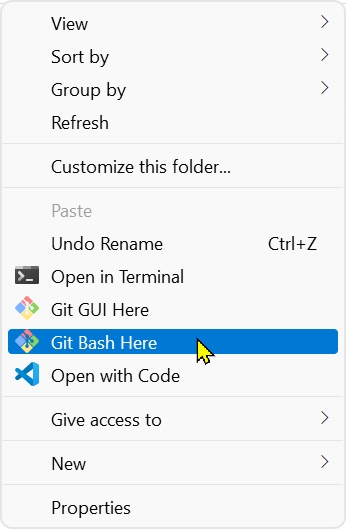
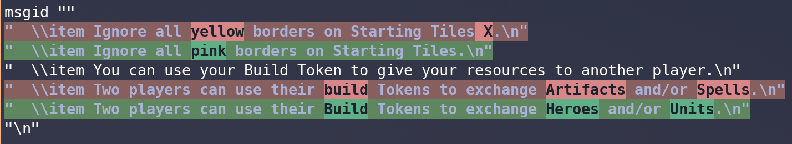

# Translations

For the purpose of this tutorial, let's assume you want to translate or update the existing translation of the Titans' Stronghold scenario in French.
Open `translations/titans_stronghold.tex/fr.po` in **Poedit**.

## Translating from scratch

If the scenario or section don't have a translation yet, go over all the entries one-by-one, save the file, and commit when you're done.

## Updating an existing translation

After opening `translations/titans_stronghold.tex/fr.po` in **Poedit**, open **git bash terminal** in the folder with the project.
Right click inside it and choose "Git Bash Here".



You'll see the terminal window.
Run this command:
```bash
tools/continuous_fuzzy_diff.sh translations/titans_stronghold.tex/fr.po
```
Choose a different file, if you're working on a diffrent scenario or section.
If there are preexisting translations, it will show you where the updates are.
Those are called "fuzzy translations".
Here's an example output indicating what needs to be done:



Make your changes in Poedit, and save the file.
The terminal will show you next fuzzy translation automatically.
Once all fuzzy translations are fixed, the output will be empty.
